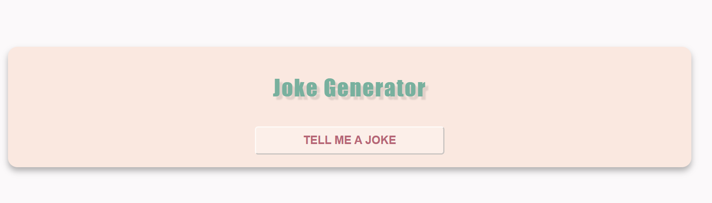
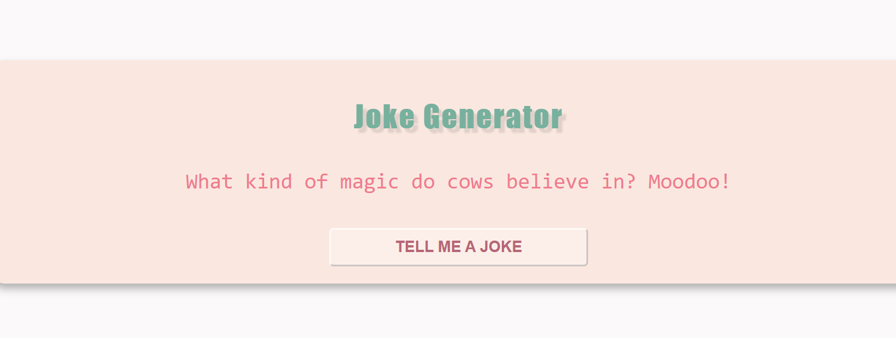

# Jokes-Generator
## Description
This is a simple jokes generator that generates random jokes from the API ninjas website. It was created using javascript.

## Installation & Usage
1. Clone this repository to your local machine using `git clone 

2. Navigate into project directory by running below commands:   
```bash
cd .\Jokes-Generator\   # for Windows Users Only!
```
3. Run `index.html`. You will see something like this:




